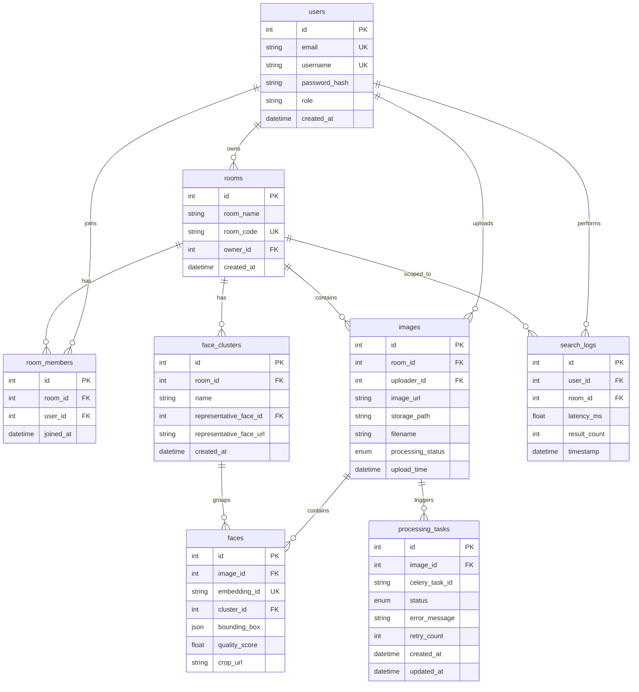

# Entity Relationship Diagram

```mermaid
erDiagram
    users ||--o{ rooms : owns
    users ||--o{ room_members : joins
    rooms ||--o{ room_members : has
    users ||--o{ images : uploads
    rooms ||--o{ images : contains
    images ||--o{ faces : contains
    face_clusters ||--o{ faces : groups
    rooms ||--o{ face_clusters : has
    users ||--o{ search_logs : performs
    rooms ||--o{ search_logs : scoped_to
    images ||--o{ processing_tasks : triggers

    users {
        int id PK
        string email UK
        string username UK
        string password_hash
        string role
        datetime created_at
    }

    rooms {
        int id PK
        string room_name
        string room_code UK
        int owner_id FK
        datetime created_at
    }

    room_members {
        int id PK
        int room_id FK
        int user_id FK
        datetime joined_at
    }

    images {
        int id PK
        int room_id FK
        int uploader_id FK
        string image_url
        string storage_path
        string filename
        enum processing_status
        datetime upload_time
    }

    faces {
        int id PK
        int image_id FK
        string embedding_id UK
        int cluster_id FK
        json bounding_box
        float quality_score
        string crop_url
    }

    face_clusters {
        int id PK
        int room_id FK
        string name
        int representative_face_id FK
        string representative_face_url
        datetime created_at
    }

    search_logs {
        int id PK
        int user_id FK
        int room_id FK
        float latency_ms
        int result_count
        datetime timestamp
    }

    processing_tasks {
        int id PK
        int image_id FK
        string celery_task_id
        enum status
        string error_message
        int retry_count
        datetime created_at
        datetime updated_at
    }
```
